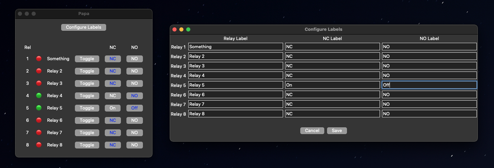
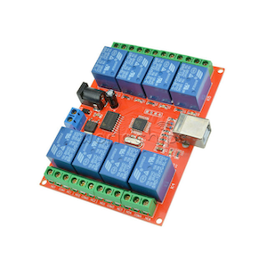

# Relay USB HID Manager
A HID USB relay interface written in ktinker for managing my dad's radio tuning raindance

The software can be used as a generic HID relay array manager

Only tested with ULN2803

## Requirements:
- [pyhidapi](https://github.com/apmorton/pyhidapi)
    - install: `pip install hid`
    - which in turn requires [hidapi](https://github.com/libusb/hidapi)
        - macOS install: `brew install hidapi`
        - [windows build guide](https://github.com/libusb/hidapi#building-on-windows)
        - [binaries](https://github.com/libusb/hidapi/releases)
- python 3.9
    - can be found at your nearest gas station
- ktinker
    - install: `pip install ktinker`
